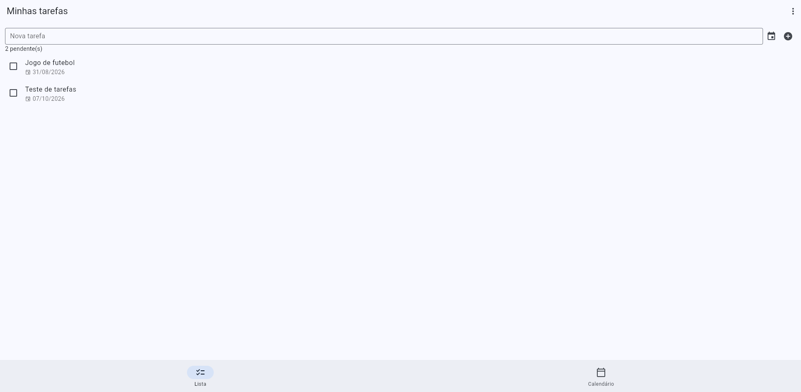
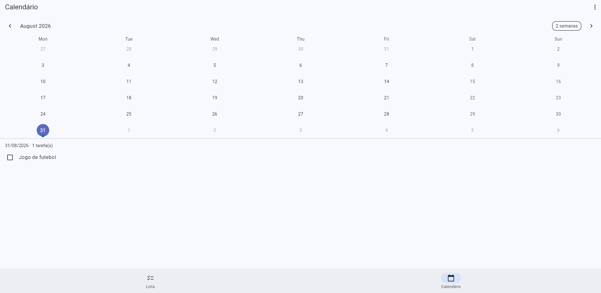
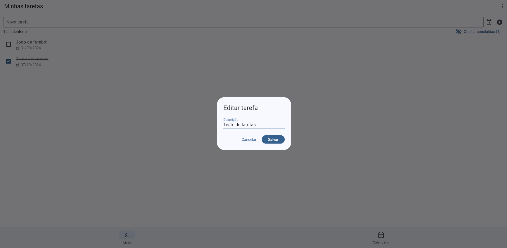
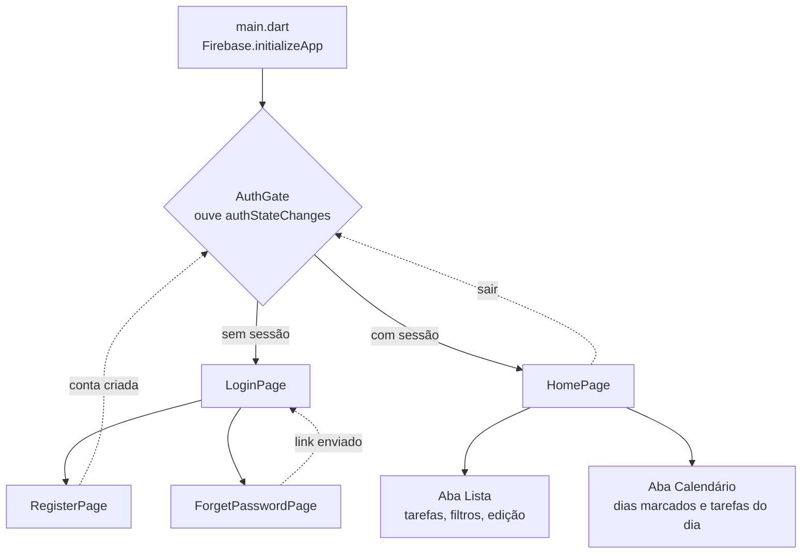
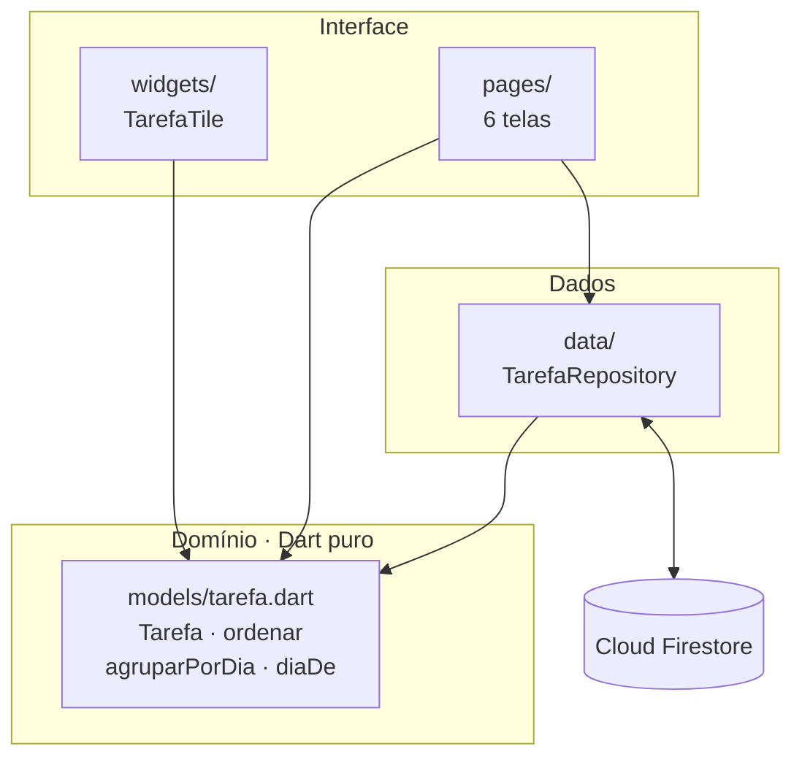
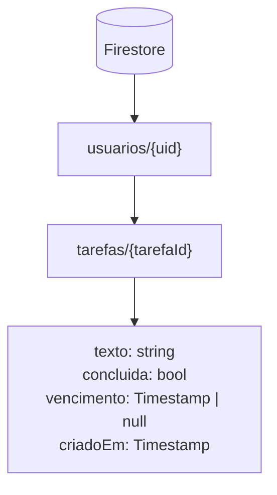

# ACQA — Gestão de Tarefas

Aplicativo Flutter de tarefas com autenticação por e-mail e senha, tarefas salvas por usuário no Cloud Firestore e um calendário ligado às datas de vencimento.

## Telas

**Lista** — tarefas ordenadas com pendentes primeiro, cada uma com sua data de vencimento.



**Calendário** — os dias com tarefa recebem marcador; tocar num dia lista as tarefas que vencem nele.



**Editar e concluídas** — tocar numa tarefa abre a edição; concluídas ficam riscadas e podem ser ocultadas.



**Entrar** — login com validação antes de ir à rede, e links para cadastro e recuperação de senha.


> As capturas são da build web rodando no navegador, em janela de desktop — por isso as áreas vazias nas laterais.

### O que cada tela faz

| Tela | O que mostra |
|---|---|
| **Entrar** | E-mail e senha, com validação antes de ir à rede. Erros dizem o que aconteceu — e-mail inexistente e senha errada devolvem a mesma frase, de propósito. Links para criar conta e recuperar senha. |
| **Criar conta** | E-mail, senha e confirmação. Recusa senha com menos de 6 caracteres antes de chamar o Firebase. |
| **Recuperar senha** | Envia o link de redefinição. Responde igual para e-mail cadastrado e não cadastrado, para não revelar quem tem conta. |
| **Lista** | Campo de nova tarefa com seletor de data opcional. As tarefas vêm ordenadas: pendentes primeiro, depois por vencimento, e por texto no empate. Tarefa vencida aparece em vermelho com a marca "atrasada". Um contador mostra quantas estão pendentes e um botão oculta ou mostra as concluídas. Tocar edita o texto; arrastar para a esquerda exclui. |
| **Calendário** | Mês, duas semanas ou semana. Os dias com tarefa recebem um marcador; tocar num dia lista as tarefas que vencem nele, com o mesmo comportamento de concluir e excluir da lista. |

## O que ele não faz

Vale dizer, para o README descrever o aplicativo e não a intenção:

- não tem notificação nem lembrete;
- não funciona offline — sem internet, a lista não carrega;
- não tem categorias, etiquetas nem tarefas recorrentes;
- não tem foto de perfil nem edição de conta além da senha.

## Fluxo de navegação



As setas pontilhadas são o ponto do desenho: **nenhuma tela navega depois de autenticar**. Não existe `Navigator.pushReplacement` no fim do `signIn`. Quem decide o que aparece é o `AuthGate`, ouvindo `authStateChanges`. Isso resolve dois problemas de uma vez — a sessão salva é reconhecida ao reabrir o app, e o logout volta ao login de qualquer lugar sem cada tela precisar saber disso.

## Camadas



O que importa aqui é a seta que **não** existe: nada vai do domínio para o Firestore. `models/tarefa.dart` não importa `cloud_firestore`. Quem converte `Timestamp` em `DateTime` é o repositório, na fronteira. É isso que permite testar o domínio com `flutter test` — sem emulador, sem rede e sem projeto no Firebase.

## Dados no Firestore



As tarefas ficam em subcoleção sob o dono, e não numa coleção única com um campo `uid`. Com o dono no caminho, a regra de segurança em [`firestore.rules`](firestore.rules) é uma comparação entre o `uid` do documento e o de quem pede, e não existe consulta capaz de trazer tarefa de outra pessoa. Na coleção única, esquecer um `where` no cliente vazaria tudo.

`vencimento` aceita nulo porque tarefa sem data é o caso mais comum — e é justamente por isso que a ordenação é feita no cliente: um `orderBy` no Firestore sobre campo nulo esconderia esses documentos.

## Como está organizado

```
lib/
  main.dart                     inicializa o Firebase e sobe o app
  app.dart                      o único MaterialApp + porta de autenticação
  models/tarefa.dart            modelo e regras de domínio, em Dart puro
  data/tarefa_repository.dart   acesso ao Firestore
  pages/                        uma tela por arquivo
  widgets/tarefa_tile.dart      a linha de tarefa, usada pela lista e pelo calendário
  utils/mensagens_auth.dart     tradução dos erros do Firebase e validações
test/tarefa_test.dart           testes do modelo, do agrupamento e da ordenação
firestore.rules                 regras de segurança do banco
```

## Rodar o projeto

```bash
flutter pub get
flutter run
```

As pastas de plataforma (`android/`, `ios/`, `web/`) são versionadas, então o projeto roda logo depois do clone. Se por algum motivo elas faltarem, recrie com `flutter create --project-name acqa .` — o nome precisa ser passado explicitamente porque a pasta do repositório tem hífen, e hífen não é válido em nome de pacote Dart.

Para conectar ao seu próprio Firebase, em vez do projeto usado no desenvolvimento:

```bash
dart pub global activate flutterfire_cli
flutterfire configure      # regrava lib/firebase_options.dart
```

No console do Firebase, habilite **Authentication → E-mail/senha** e crie um banco **Firestore**. Depois publique as regras deste repositório:

```bash
firebase deploy --only firestore:rules
```

Sem essa última etapa o Firestore fica no modo de teste, que expira e libera acesso amplo enquanto vale.

## Testes

```bash
flutter analyze
flutter test
```

Doze testes cobrem a leitura de documento incompleto ou com data em formato inesperado, o agrupamento por dia (incluindo tarefas sem data, que ficam fora da agenda) e a ordem de exibição. São testes de domínio: não sobem Firebase, não precisam de emulador.

## Histórico

**v1.1** — as tarefas passaram a ser salvas no Firestore por usuário; antes viviam numa lista em memória e sumiam ao fechar o app. O calendário, que só desenhava os dias, passou a ler as mesmas tarefas e marcar as datas de vencimento. Também saíram o `MaterialApp` aninhado dentro da HomePage, os `TextEditingController` sem `dispose` e o tratamento de erro que respondia a mesma frase para qualquer falha de login. Foram adicionados os testes, o `analysis_options.yaml` e as regras de segurança do Firestore.

**v1.0** — versão acadêmica, com autenticação no Firebase e tarefas em memória.

## Sobre

Projeto desenvolvido para a disciplina de Desenvolvimento para Dispositivos Móveis e mantido depois como estudo. Autor: [Alan Fabrício de Morais Filho](https://github.com/AlanFMF).
